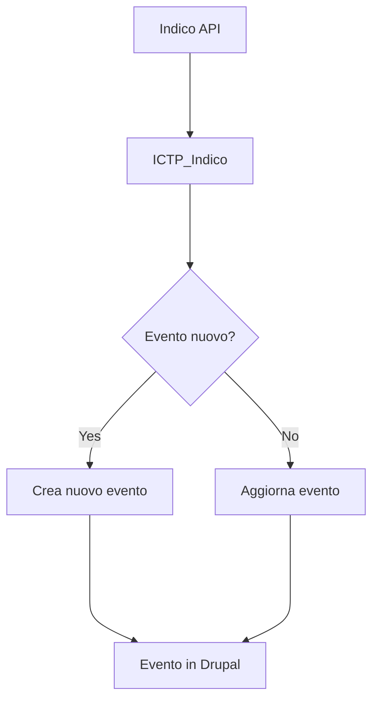
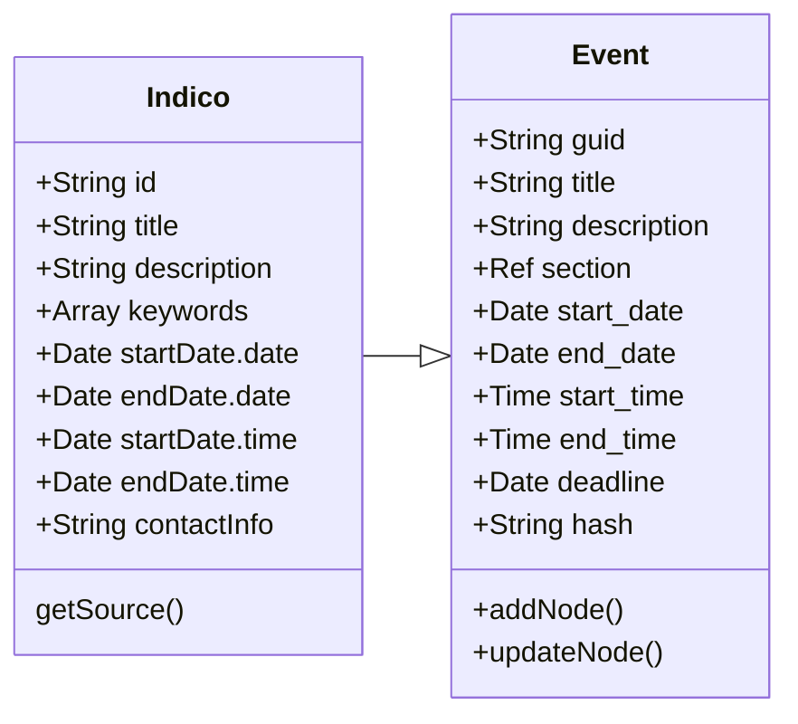

# ICTP Indico

INTRODUCTION
------------

The ICTP Indico module imports the events from Indico (indico.ictp.it) to Drupal.

REQUIREMENTS
------------

This module requires no modules outside of Drupal core.

INSTALLATION
------------

 * Install as you would normally install a contributed Drupal module. Visit
   https://www.drupal.org/node/1897420 for further information.

CONFIGURATION
-------------

The module has no menu or modifiable settings. There is no configuration. When enabled, the module will add the routes:
- /admin/ictp_indico
- /admin/ictp_indico/add
- /admin/ictp_indico/delete

UPDATE
--------
The process of updating an event is sensitive to:
- indico content
- field_indico_keywords
- field_indico_topic

PROCESS
--------

